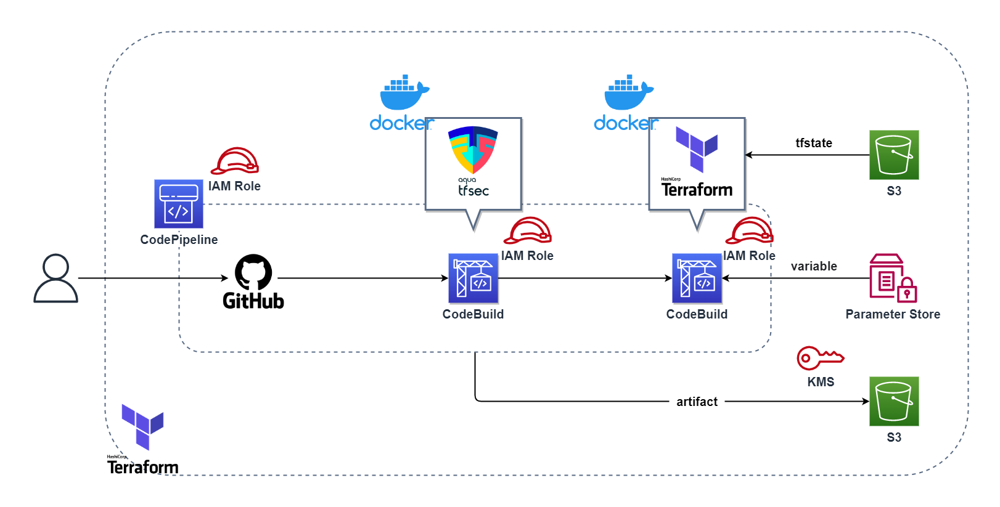

# Terraformで作成する構成

Terraformを使って、[istone-you/my-amplify-website-terraform](https://github.com/istone-you/my-amplify-website-terraform)のTerraformをCICDする構成を作成しました。

tfvarsファイルを作成して以下の変数を指定する必要があります。
- aws_region     =  AWSのリージョン
- access_key     =  AWSのアクセスキー
- secret_key     =  AWSのシークレットキー
- github_token   =  GitHubのトークン
- github_owner   =  GitHubのユーザー名